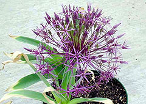

```{r setup, include=FALSE}
knitr::opts_chunk$set(echo = TRUE)
```

# 1. Descripción

El *dataset* creado consta de diferentes características de 267 flores (actualizadas hasta 2018) con el fin de relacionarlas con su necesidad de luz solar.



# 2. Contexto e inspiración

La creación del *dataset* se ha realizado con fines académicos para la práctica de extracción de información, así pues, se ha pensado en la creación de un conjunto de datos que también pueda ser utilizado con fines académicos en la práctica de minería de datos. Así pues, se ha escogida un tema bien conocido com oson las flores y características básicas donde pueden encontrarse sus necesidades de luz solar, altura, ciclo de vida... Y que además abre la posibilidad de aumentar el conjunto de datos con más información.

# 3. Contenido

Para cada flor, se ha obtenido:

* **Name**: nombre de la flor.
* **SunNeeds**: necesidad de luz solar.
* **LifeCycle**: ciclo de vida de la flor.
* **EaseOfCare**: facilidad de cuidado.
* **Height**: altura.
* **Spread**: propagación.

# 4. Agradecimientos

Los datos han sido recolectados desde la base de datos online de la ['Cornell Univeristy'](http://www.gardening.cornell.edu/homegardening/scenee139.html?ref=organicgglunkwn&prid=pfseogglunkwn). Mediante el uso de Python y de técnicas de *Web Scraping* para extraer la información alojada en las páginas HTML que componen la base de datos.

# 5. Licencia

La licencia de este *dataset* es **CC BY-SA 4.0 License**. Con la cual puede utilizarse el conjunto de datos nombrando al autor y las modificaciones realizadas y cualquier trabajo adicional debe usar esta misma licencia, lo cuál es perfecto para un trabajo académico con fines de practicar las habilidades descritas anteriormente.